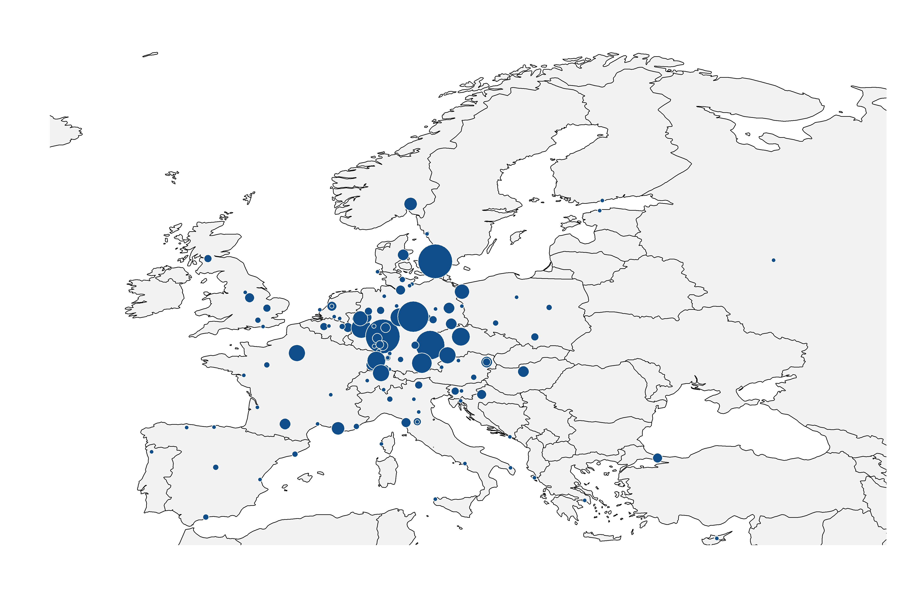
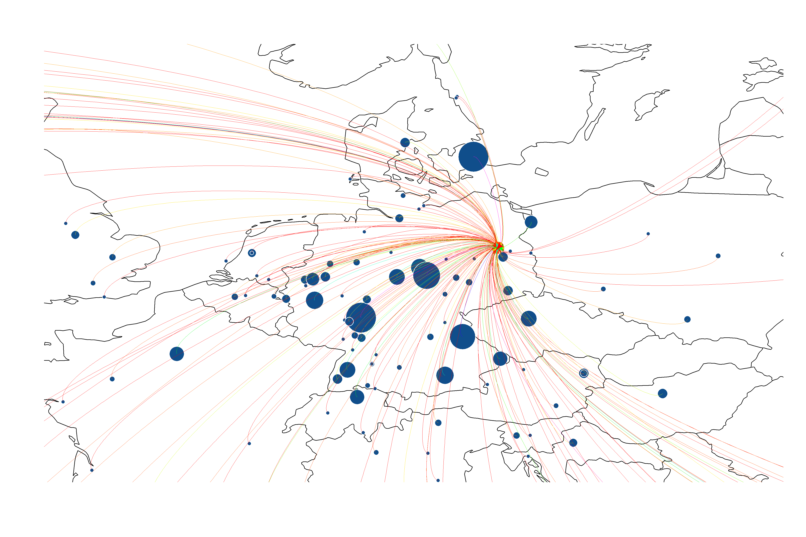

[](http://quantlet.de/)

## [](http://quantlet.de/) **CRCmapev** [](http://quantlet.de/)

```yaml

Name of QuantLet : CRCmapev

Published in : CRC - Evaluating Research Performance of the Collaborative Research Center 649

Description : 'Produces a map with the locations of scientific events visited by CRC members from
2005 to 2016, June (paid from CRC)'

Keywords : 'plot, map, multivariate, analysis, descriptive, descriptive-methods, distribution,
graphical representation, visualization, data visualization'

Author : Alona Zharova, Janine Tellinger-Rice, Wolfgang Karl Härdle

Submitted : Sun, October 16 2016 by Nicole Hermann, Alona Zharova

Datafile : 'conferences.txt - The data set contains the names of cities where CRC members visited
some scientific event, the latitude and longitude data of each city and the total number of visits'

Output: 
- 1: 'World map with the locations of scientific events visited by CRC members from 2005 to 2016,
June (paid from CRC)'
- 2: 'Map of Europe with the locations of scientific events visited by CRC members from 2005 to
2016, June (paid from CRC)'
- 3: 'MAp of Germany and close countries with the locations of scientific events visited by CRC
members from 2005 to 2016, June (paid from CRC)'

```






### R Code:
```r
# Close windows and clear variables
graphics.off()
rm(list = ls(all = TRUE))

# Install packages / Load library
libraries = c("maps", "diagram", "plotrix", "rworldmap", "RColorBrewer")
lapply(libraries, function(x) if (!(x %in% installed.packages())) {install.packages(x)})
lapply(libraries, library, quietly = TRUE, character.only = TRUE)
palette(rainbow(20))

# Load data
edges<- read.table("conferences.txt", header=TRUE)

# Set font and color for output, depending on choice
numdata        = length(edges)
blues          = brewer.pal(numdata, "Blues")
blues.rev      = rev(blues)
font           = "serif" # Font Times
res            = 300     # resolution
width          = 15      # width of plot pdf
height         = 10      # height of plot pdf

# Plot map of the world with locations of scientific events visited by CRC members
png(file = "CRCmapev_world.png", width = width, height = height, units = "in", res = res, family = font)
map(col="#f2f2f2", fill=TRUE, bg="white", mar = rep(0, 4)) 
with(edges, points(long.y, lat.y, col="white", bg="dodgerblue4", pch=21, cex=rescale(col, c(1, 8)))) 
apply(edges[, -(1:2)], 1, function(x) curvedarrow(to=x[3:4], from=x[1:2], lcol="lightblue", curve=.1, endhead=FALSE, arr.pos = 0, lwd=.1))
dev.off() 

# Plot map of the europe with locations of scientific events visited by CRC members
png(file = "CRCmapev_eur.png", width = width, height = height, units = "in", res = res, family = font)
newmap <- getMap(resolution = "low")
plot(newmap, xlim = c(0, 30), ylim = c(36, 70), col="#f2f2f2", asp = 1)
with(edges, points(long.y, lat.y, col="white", bg="dodgerblue4", pch=21, cex=rescale(col, c(1, 8)))) 
dev.off() 

# Plot map of Germany including some european countries 
png(file = "CRCmapev_germ.png", width = width, height = height, units = "in", res = res, family = font)
newmap <- getMap(resolution = "low")
plot(newmap, xlim = c(10, 11), ylim = c(45, 59),  asp = 1)
with(edges, points(long.y, lat.y, col="white", bg="dodgerblue4", pch=21, cex=rescale(col, c(1, 8)))) 
apply(edges[, -(1:2)], 1, function(x) curvedarrow(to=x[3:4], from=x[1:2], lcol=x[5], curve=.1, endhead=FALSE, arr.pos = 0, lwd=.1))
dev.off() 


```
