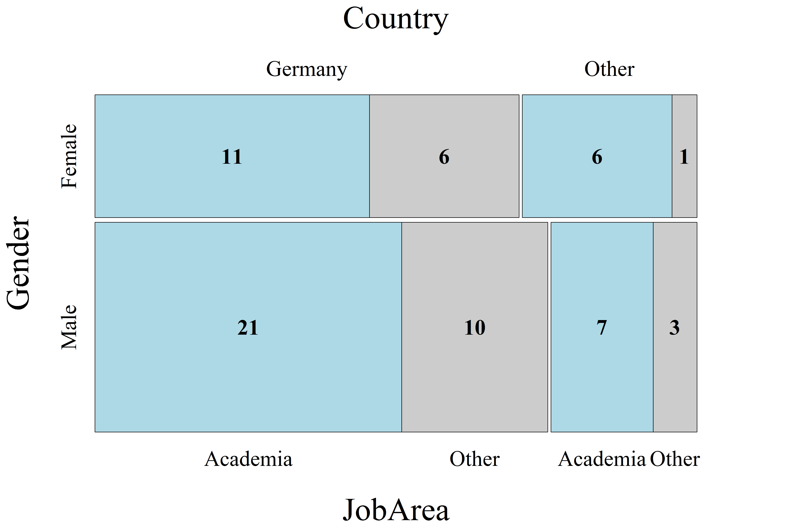

[](http://quantlet.de/)

## [](http://quantlet.de/) **CRCmosphd** [](http://quantlet.de/)

```yaml

Name of QuantLet : CRCmosphd

Published in : CRC - Evaluating Research Performance of the Collaborative Research Center 649

Description : 'Produces the mosaic plot of current jobs (for June, 2016) of CRC members who
defended their PhD from 2005 to 2016, June'

Keywords : 'plot, mosaic plot, multivariate, analysis, descriptive, descriptive-methods,
distribution, graphical representation, visualization, data visualization'

Author : Alona Zharova

Submitted : Sun, October 16 2016 by Alona Zharova

Datafile : 'CRCmosphd_data.csv - The data set is contingency table that displays the multivariate
frequency distribution of the variables: gender (male/female), JobArea (Academia/Other), Country
(Germany/Other) and the corresponding frequency.'

Output : 'Mosaic plot of current jobs (for June, 2016) of 65 CRC members who defended their PhD
from 2005 to 2016, June'

```




### R Code:
```r
# Close windows and clear variables
graphics.off()
rm(list = ls(all = TRUE))

# Install packages / Load library
libraries = c("vcd")
lapply(libraries, function(x) if (!(x %in% installed.packages())) {install.packages(x)})
lapply(libraries, library, quietly = TRUE, character.only = TRUE)

# Load data
data = read.csv2("CRCmosphd_data.csv", sep = ";", dec = ",", header = T, stringsAsFactors = FALSE)

Gender = data[,1]
JobArea = data[,2]
Country = data[,3]
freq2 = data[,4]

# Set font and color for output, depending on choice
font           = "serif" # Font Times
res            = 300     # resolution
width          = 15      # width of plot pdf
height         = 10      # height of plot pdf
fontsize_big   = 44      # font size of the main titles
fontsize_small = 30      # font size of the axes
marg           = 9       # margin
fontsize_cells = 30      # font size of cell labels

# Plot
png(file = "CRCmosphd.png", width = width, height = height, units = "in", res = res, family = font)
mosaic(~Gender + JobArea + Country, data = data,  
       labeling = labeling_values, highlighting="JobArea", 
       highlighting_fill=c("lightblue", "grey80"), direction = c("h","v", "v"),
       gp_text = gpar(fontsize = fontsize_cells,fontface = 2), 
       labeling_args = list(gp_labels = gpar(fontsize = fontsize_small, fontface = 1, fontfamily = font), 
                            gp_varnames = gpar(fontsize = fontsize_big, fontface = 1, fontfamily = font)),
       margins = unit(c(marg, marg, marg, marg), "lines"))
dev.off() 


```
